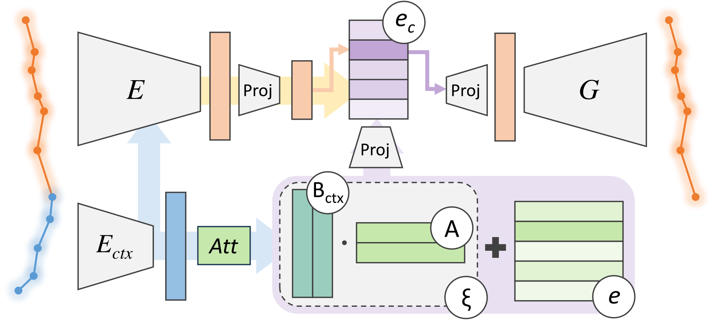
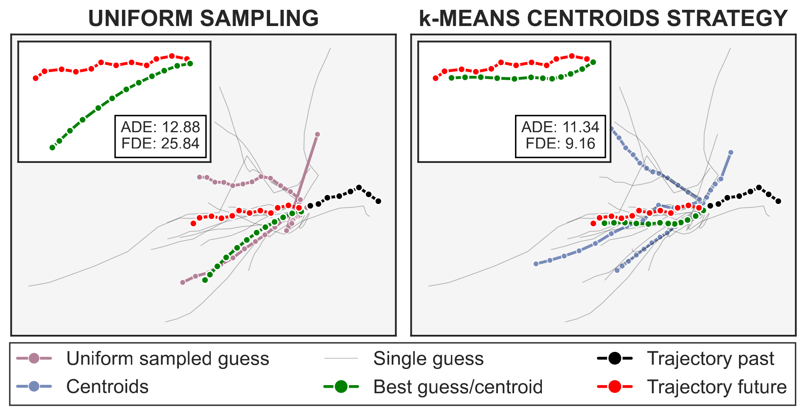

# Trajectory Forecasting through Low-Rank Adaptation of Discrete Latent Codes （LRVQ）

Official **PyTorch** code for ICPR'24 paper "Trajectory Forecasting through Low-Rank Adaptation of Discrete Latent Codes".


## 1. Overview

<div align="center">  
  
</div>

**Abstract**: Trajectory forecasting is crucial for video surveillance analytics, as it enables the anticipation of future movements for a set of agents, e.g., basketball players engaged in intricate interactions with long-term intentions. Deep generative models offer a natural learning approach for trajectory forecasting, yet they encounter difficulties in achieving an optimal balance between sampling fidelity and diversity. We address this challenge by leveraging Vector Quantized Variational Autoencoders (VQ-VAEs), which utilize a discrete latent space to tackle the issue of posterior collapse. Specifically, we introduce an instance-based codebook that allows tailored latent representations for each example. In a nutshell, the rows of the codebook are dynamically adjusted to reflect contextual information (i.e., past motion patterns extracted from the observed trajectories). In this way, the discretization process gains flexibility, leading to improved reconstructions. Notably, instance-level dynamics are injected into the codebook through low-rank updates, which restrict the customization of the codebook to a lower dimension space. The resulting discrete space serves as the basis of the subsequent step, which regards the training of a diffusion-based predictive model. We show that such a two-fold framework, augmented with instance-level discretization, leads to accurate and diverse forecasts, yielding state-of-the-art performance on three established benchmarks.
<div  align="center">  
  
</div>


## 2. Code Guidance

Overall project structure:
```text
.
├── assets
│   ├── cluster.png
│   └── mainfig_vqvae.png
├── backbones
│   ├── decoder_var_layers.py
│   ├── diff_transformers_utils.py
│   ├── diffusion_transformer.py
│   ├── __init__.py
│   ├── pixel_cnn.py
│   ├── quantization_layers.py
│   ├── stt.py
│   └── vqvae.py
├── data
├── datasets
│   ├── __init__.py
│   ├── nba.py
│   ├── nfl.py
│   ├── sdd.py
│   └── utils
│       ├── base_dataset.py
│       ├── collate_funcs.py
│       └── __init__.py
├── models
│   ├── __init__.py
│   ├── scratchtrajectory.py
│   ├── scratchtrajectory_vqvae.py
│   └── utils
│       ├── base_model.py
│       ├── __init__.py
│       └── vq_utils.py
├── README.md
├── requirements.txt
├── sbatches
│   └── best_hp.yaml
└── utils
    ├── args.py
    ├── conf.py
    ├── eval.py
    ├── __init__.py
    ├── kmeans.py
    ├── loss.py
    ├── main.py
    ├── preprocess_nfl.py
    ├── scheduler.py
    ├── status.py
    ├── subsample.py
    ├── training.py
    ├── utilities.py
    └── wandbsc.py

```

Please download the data and results from [Google Drive](https://drive.google.com/drive/folders/13UBkGSHZjpkbMzejjgQfcgpG2Tg0cpmP?usp=sharing). The data should be placed in the `./data` folder, to have a structure like this:
```text
.
├── data
│   ├── nba
│   ├── nfl
│   └── sdd
```


### 2.1. Environment

Create a new python environment (`lrvq`) using `conda`:
```
conda create -n lrvq python=3.8
conda activate lrvq
```

Install required packages using Command 1:
```bash
# Command 1:
pip install -r requirements.txt
```

### 2.2. Training

#### First Stage Training

SDD

```bash

python utils/main.py --alpha_embedding_annealing cos_anneal step 0 3000 0 1 --backbone vqvae --batch_size 256 --d_model 64 --dataset sdd --eval_batch_size 256 --generated_samples 1 --k_way 16 --lr 0.0005 --lr_decay 0.6 --lr_decay_steps 1500,3000,4000 --model scratchtrajectory_vqvae --n_epochs 7000 --n_layers 1 --n_workers 2 --lora_alpha_annealing cos_anneal step 50000 100000 0 1 --lora_r 8 --opt_betas "(0.5,0.9)" --optimizer AdamW --project_codebook_dim 8 --save_checks True --scheduler multistep --use_saved_pixelcnn True --vq_module VariationalQuantizationLora

```

NBA

```bash

python utils/main.py --alpha_embedding_annealing cos_anneal step 0 3000 0 1 --backbone vqvae --batch_size 64 --d_model 64 --dataset nba --eval_batch_size 64 --generated_samples 20 --k_way 16 --lr 0.0005 --lr_decay 0.6 --lr_decay_steps 500,600,650 --model scratchtrajectory_vqvae --n_epochs 700 --n_layers 1 --n_workers 2 --lora_alpha_annealing cos_anneal step 50000 100000 0 1 --lora_r 8 --opt_betas "(0.5,0.9)" --optimizer AdamW --project_codebook_dim 8 --save_checks True --save_every 50 --scheduler multistep --use_saved_pixelcnn True --validate_every 50 --vq_module VariationalQuantizationLora

```

NFL

```bash

python utils/main.py --alpha_embedding_annealing cos_anneal step 0 3000 0 1 --backbone vqvae --batch_size 32 --d_model 64 --dataset nfl --dataset_name 20240210142434 --eval_batch_size 32 --generated_samples 20 --k_way 16 --lr 0.0005 --lr_decay 0.6 --lr_decay_steps 500,600,650 --model scratchtrajectory_vqvae --n_epochs 700 --n_layers 1 --n_workers 2 --lora_alpha 1 --lora_alpha_annealing cos_anneal step 50000 100000 0 1 --lora_r 4 --opt_betas "(0.5,0.9)" --optimizer AdamW --project_codebook_dim 8 --save_checks True --save_every 50 --scheduler multistep --use_saved_pixelcnn True --validate_every 50 --vq_module VariationalQuantizationLora

```

And the results are stored under the `./data/results` folder.

#### Second Stage Training

SDD

```bash

python utils/main.py --args_to_update pixelcnn_scheduler_name validate_every save_every batch_size save_checks use_saved_pixelcnn set_device only_eval custom_pixelcnn pixelcnn_opt pixelcnn_n_epochs pixelcnn pixelcnn_lr pixelcnn_n_layers diff_diffusion_step use_saved_pixelcnn wb_prj n_workers job_id rotate_trj_pixelcnn generated_samples --backbone vqvae --batch_size 256 --checkpoint_path <first stage checkpoint_path> --custom_pixelcnn True --dataset sdd --diff_diffusion_step 100 --eval_batch_size 256 --generated_samples 20 --lr 0.0005 --model scratchtrajectory_vqvae --n_epochs 1 --n_workers 2 --only_eval True --pixelcnn PixelDiffusionTransformer --pixelcnn_categorical_temporal_dim False --pixelcnn_lr 1e-3 --pixelcnn_n_epochs 3000 --pixelcnn_n_layers 1 --pixelcnn_opt adamw --pixelcnn_scheduler_name multistep2 --rotate_trj_pixelcnn True --save_checks True --save_every 50 --use_saved_pixelcnn False --validate_every 50 

```

NBA

```bash

python utils/main.py --args_to_update batch_size save_checks use_saved_pixelcnn only_eval custom_pixelcnn pixelcnn_opt pixelcnn_n_epochs pixelcnn pixelcnn_lr pixelcnn_n_layers diff_diffusion_step use_saved_pixelcnn n_workers job_id validate_every save_every random_rotation_degrees generated_samples --backbone vqvae --batch_size 64 --checkpoint_path <first stage checkpoint_path> --custom_pixelcnn True --dataset nba --diff_diffusion_step 100 --eval_batch_size 64 --generated_samples 20 --lr 0.0005 --model scratchtrajectory_vqvae --n_epochs 1 --n_workers 2 --only_eval True --pixelcnn PixelDiffusionTransformer --pixelcnn_categorical_temporal_dim False --pixelcnn_lr 0.0005 --pixelcnn_n_epochs 1000 --pixelcnn_n_layers 1 --pixelcnn_opt adamw --random_rotation_degrees 5 --save_checks True --save_every 70 --use_saved_pixelcnn False --validate_every 70 

```

NFL

```bash

python utils/main.py --args_to_update batch_size save_checks use_saved_pixelcnn only_eval custom_pixelcnn pixelcnn_opt pixelcnn_n_epochs pixelcnn pixelcnn_lr pixelcnn_n_layers diff_diffusion_step use_saved_pixelcnn n_workers job_id random_rotation_degrees validate_every save_every generated_samples --backbone vqvae --batch_size 32 --checkpoint_path <first stage checkpoint_path> --custom_pixelcnn True --dataset nfl --diff_diffusion_step 100 --eval_batch_size 32 --generated_samples 20 --lr 0.0005 --model scratchtrajectory_vqvae --n_epochs 1000 --n_workers 2 --only_eval True --pixelcnn PixelDiffusionTransformer--pixelcnn_lr 0.0005 --pixelcnn_n_epochs 700 --pixelcnn_n_layers 1 --pixelcnn_opt adamw --random_rotation_degrees 5 --save_checks True --save_every 100 --use_saved_pixelcnn False --validate_every 100 

```

### 2.3. Evaluation

SDD

```bash

python utils/main.py --args_to_update batch_size eval_batch_size save_checks use_saved_pixelcnn only_eval custom_pixelcnn use_saved_pixelcnn generated_samples reduce_sampling_method n_reduced_samples --backbone vqvae --batch_size 32 --checkpoint_path <second stage checkpoint_path> --custom_pixelcnn False --dataset sdd --eval_batch_size 200 --generated_samples 200 --lr 0.0005 --model scratchtrajectory_vqvae --n_epochs 1 --n_reduced_samples 20 --only_eval True --reduce_sampling_method method:kmeans --save_checks False --use_saved_pixelcnn True 

```

NBA

```bash

python utils/main.py --args_to_update batch_size eval_batch_size save_checks use_saved_pixelcnn only_eval custom_pixelcnn use_saved_pixelcnn generated_samples reduce_sampling_method n_reduced_samples --backbone vqvae --batch_size 32 --checkpoint_path <second stage checkpoint_path> --custom_pixelcnn False --dataset nba --eval_batch_size 200 --generated_samples 200 --lr 0.0005 --model scratchtrajectory_vqvae --n_epochs 1 --n_reduced_samples 20 --only_eval True --reduce_sampling_method method:kmeans --save_checks False --use_saved_pixelcnn True 

```

NFL

```bash

python utils/main.py --args_to_update eval_batch_size save_checks use_saved_pixelcnn set_device only_eval custom_pixelcnn use_saved_pixelcnn generated_samples reduce_sampling_method n_reduced_samples --backbone vqvae --batch_size 32 --checkpoint_path <second stage checkpoint_path> --custom_pixelcnn False --dataset nfl --eval_batch_size 128 --generated_samples 200 --lr 0.0005 --model scratchtrajectory_vqvae --n_epochs 1000 --n_reduced_samples 20 --only_eval True --reduce_sampling_method method:kmeans --save_checks False --use_saved_pixelcnn True  

```


## 3. Citation
If you find this code useful for your research, please cite our paper:

```bibtex
@article{benaglia2024trajectory,
  title={Trajectory Forecasting through Low-Rank Adaptation of Discrete Latent Codes},
  author={Benaglia, Riccardo and Porrello, Angelo and Buzzega, Pietro and Calderara, Simone and Cucchiara, Rita},
  journal={arXiv preprint arXiv:2405.20743},
  year={2024}
}
```


## 4. Acknowledgement

Some code is borrowed from [Mammoth](https://github.com/aimagelab/mammoth), [VQ-Diffusion](https://github.com/microsoft/VQ-Diffusion). We thank the authors for releasing their code.

[](https://github.com/aimagelab/LRVQ)

**TODO list**:
